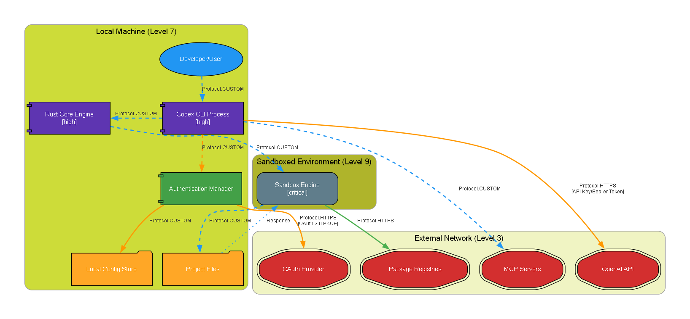

# <i><b>`ThreatModel-MCP`</b></i>

Model Context Protocol server for AI-powered threat modeling.<br>

---

<samp>

## <b>Setup</b>

1. <b>`Install dependencies`</b><br>
   <code>pip install -r requirements.txt</code>

2. <b>`Install Graphviz`</b> (optional, for PNG diagrams)<br>
   - <b>Windows</b>: Download from https://graphviz.org/download/<br>
   - <b>Mac</b>: <code>brew install graphviz</code><br>
   - <b>Linux</b>: <code>sudo apt-get install graphviz</code>

3. <b>`Configure MCP client`</b> (Claude Desktop, etc.)<br>
   ```json
   {
     "mcpServers": {
       "threatmodel": {
         "command": "python",
         "args": ["/full/path/to/advanced_threatmodel_server.py"]
       }
     }
   }
   ```

---

## <b>Available Tools</b>

### <code>create_threat_model</code>
Creates comprehensive threat models with components, boundaries, and data flows.

<b>Parameters:</b><br>
- <code>system_name</code> - Name of the system<br>
- <code>components</code> - Array of system components with types, boundaries, security controls<br>
- <code>boundaries</code> - Trust boundaries with security levels (0-10)<br>
- <code>dataflows</code> - Data flows between components with protocols and classifications<br>
- <code>output_format</code> - "diagram", "pytm_code", "threats", or "full_analysis"<br>
- <code>auto_save</code> - Auto-save files (default: true)<br>
- <code>save_path</code> - Directory to save files (default: current directory)

### <code>analyze_security_threats</code>
Performs deep security analysis using multiple frameworks.

<b>Parameters:</b><br>
- <code>analysis_depth</code> - "basic", "standard", "comprehensive", or "paranoid"<br>
- <code>threat_frameworks</code> - ["STRIDE", "MITRE_ATTACK", "OWASP", "NIST", "CIS"]<br>
- <code>focus_areas</code> - Authentication, data protection, network security, etc.<br>
- <code>compliance_frameworks</code> - ["SOC2", "ISO27001", "HIPAA", "PCI-DSS", "GDPR"]

### <code>generate_security_controls</code>
Generates security control recommendations based on threats.

<b>Parameters:</b><br>
- <code>threats</code> - Array of identified threats<br>
- <code>risk_appetite</code> - "low", "medium", or "high"<br>
- <code>technology_stack</code> - Current technologies (AWS, k8s, etc.)<br>
- <code>prioritization_method</code> - "risk_based", "quick_wins", "compliance_driven"

### <code>validate_architecture</code>
Validates architecture against security best practices.

<b>Parameters:</b><br>
- <code>components</code> - System components to validate<br>
- <code>validation_rules</code> - ["zero_trust", "encryption_in_transit", "api_gateway_pattern"]<br>
- <code>architecture_patterns</code> - ["microservices", "serverless", "hybrid_cloud"]

---

## <b>Component Types</b>

<b>Actors:</b> user, admin, service_account<br>
<b>Services:</b> server, api_gateway, microservice, lambda, container<br>
<b>Data:</b> database, cache, message_queue, file_storage<br>
<b>Infrastructure:</b> load_balancer, firewall, external_service

---

## <b>Protocols & Classifications</b>

<b>Protocols:</b> HTTPS, gRPC, WebSocket, SQL, Redis, S3 API<br>
<b>Data Classifications:</b> PUBLIC → INTERNAL → CONFIDENTIAL → RESTRICTED → TOP_SECRET

---

## <b>Auto-Save Features</b>

Generated files (with timestamps):<br>
- <code>SystemName_threatmodel_YYYYMMDD_HHMMSS.png</code> - Diagram (when output_format="diagram")<br>
- <code>SystemName_threatmodel_YYYYMMDD_HHMMSS.dot</code> - DOT source (always)<br>
- <code>SystemName_threatmodel_YYYYMMDD_HHMMSS.py</code> - PyTM code (always)<br>
- <code>SystemName_threatmodel_analysis_YYYYMMDD_HHMMSS.md</code> - Analysis report (when output_format="full_analysis")

---

## <b>Example Usage</b>

<b>Prompt used to generate the diagram below:</b><br>
<code>"Create a high level threat diagram of current codebase"</code>



<i>Example threat model diagram generated from a cloned <a href="https://github.com/openai/codex">OpenAI Codex</a> codebase, showing multi-layer security boundaries, component classifications, and encrypted data flows between services.</i>

---

## <b>Troubleshooting</b>

<b>Graphviz issues:</b> Verify with <code>dot -V</code><br>
<b>DOT syntax errors:</b> Component names automatically sanitized<br>
<b>No Python:</b> Ensure Python in PATH

---


</samp>
